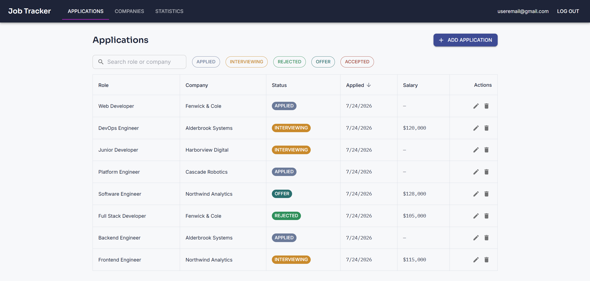
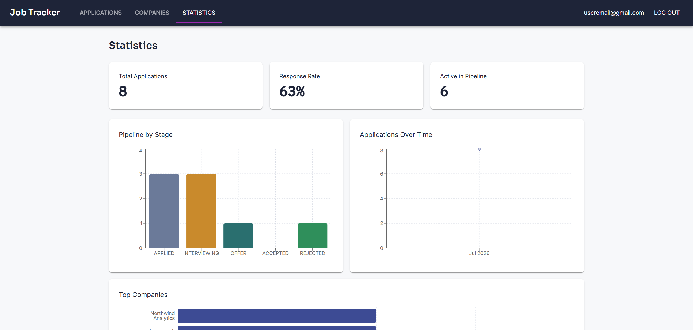

# Job Tracker

A full-stack application for tracking job applications — replacing the spreadsheet most people default to during a job search with something built for the job: sortable/filterable views, company management, and pipeline statistics.

**Live app:** [job-tracker-frontend-silk.vercel.app](https://job-tracker-frontend-silk.vercel.app)

> Note: the backend runs on Render's free tier, which spins down after inactivity — the first request after a period of idleness may take 30–60 seconds to respond while the server wakes up.

<!-- ADD SCREENSHOTS HERE -->
<!--  -->
<!--  -->

## Features

- **Authentication** — email/password registration and login, with server-side sessions (not JWTs) stored in Postgres and referenced via an httpOnly cookie
- **Applications** — create, edit, delete, search, filter by status, and sort by any column
- **Companies** — manage companies independently, or create one inline while adding an application, with per-user uniqueness enforced on company names
- **Statistics** — pipeline breakdown by stage, applications over time, response rate, and top companies, computed client-side from application data
- **Ownership-scoped data** — every read/write is scoped to the authenticated user at the database query level, not just the UI

## Tech stack

| | |
|---|---|
| **Frontend** | React, TypeScript, Vite, React Router, MUI, Recharts |
| **Backend** | Node.js, Express, TypeScript |
| **Database** | PostgreSQL ([Neon](https://neon.tech)), [Prisma](https://www.prisma.io) ORM |
| **Auth** | bcrypt password hashing, DB-backed sessions, httpOnly cookies |
| **Hosting** | Frontend on [Vercel](https://vercel.com), backend on [Render](https://render.com) |

## Why session-based auth, not JWT

This was a deliberate choice, not a default: with a single Express instance and a database already in place via Prisma, sessions give instant revocation (delete the row, the session is dead everywhere) and no token refresh/expiry logic to build — at the cost of a DB lookup per authenticated request, which is a fine tradeoff at this scale. See [`backend/src/middleware/require-auth.ts`](backend/src/middleware/require-auth.ts) for the implementation.

## Project structure

This is an npm workspaces monorepo:

```
job-tracker/
├── frontend/           # React + Vite app
├── backend/            # Express API
└── packages/
    └── types/          # Shared TypeScript types for API request/response shapes,
                         # imported by both frontend and backend
```

`packages/types` is the single source of truth for the shape of data crossing the frontend/backend boundary — changing a field there produces compile errors on both sides if a consumer isn't updated to match.

## Running locally

**Prerequisites:** Node.js 20+, npm, and a PostgreSQL database (a free [Neon](https://neon.tech) instance works well).

```bash
git clone https://github.com/adedhi/job-tracker.git
cd job-tracker
npm install
```

**Backend** — create `backend/.env`:
```
DATABASE_URL=postgresql://...
FRONTEND_URL=http://localhost:5173
NODE_ENV=development
PORT=3000
```

Build the shared types package and run migrations:
```bash
npm run build --workspace=@job-tracker/types
cd backend
npx prisma migrate dev
npm run dev
```

**Frontend** — create `frontend/.env`:
```
VITE_API_URL=http://localhost:3000
```

```bash
cd frontend
npm run dev
```

The app will be running at `http://localhost:5173`, talking to the API at `http://localhost:3000`.

## API overview

All routes except `/api/auth/register` and `/api/auth/login` require an authenticated session.

| Method | Route | Description |
|---|---|---|
| POST | `/api/auth/register` | Create an account, starts a session |
| POST | `/api/auth/login` | Authenticate, starts a session |
| POST | `/api/auth/logout` | Ends the current session |
| GET | `/api/auth/me` | Returns the current user, if authenticated |
| GET | `/api/applications` | List the user's applications |
| POST | `/api/applications` | Create an application |
| PATCH | `/api/applications/:id` | Update an application |
| DELETE | `/api/applications/:id` | Delete an application |
| GET | `/api/companies` | List the user's companies |
| POST | `/api/companies` | Create a company |
| PATCH | `/api/companies/:id` | Update a company |
| DELETE | `/api/companies/:id` | Delete a company |

## License

