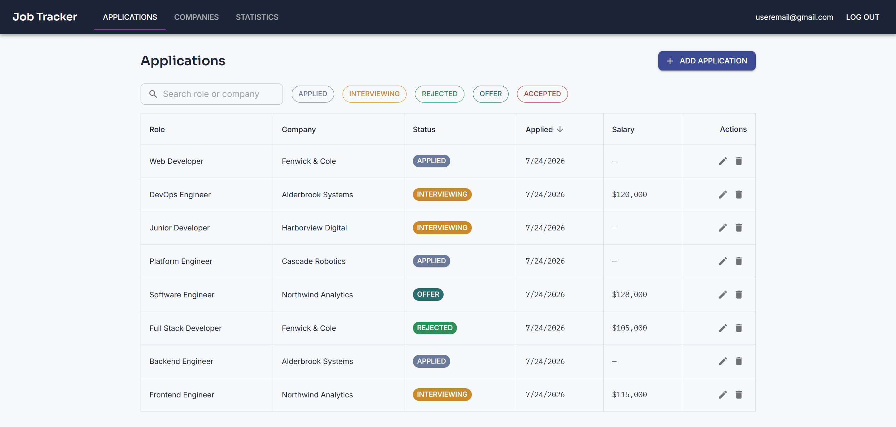
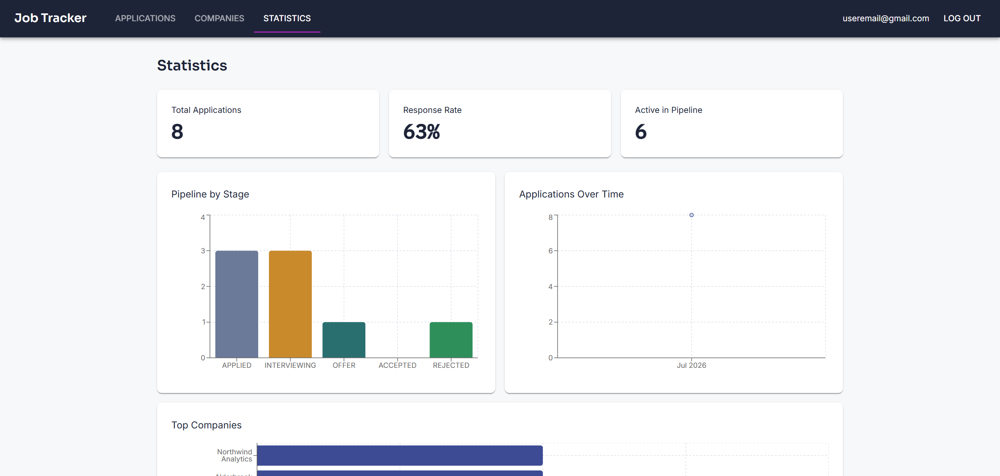

# Job Tracker

A full-stack application for tracking job applications. Replaces the spreadsheet most people default to during a job search with something built for the job: sortable/filterable views, company management, and pipeline statistics.

**Live app:** [job-tracker-frontend-silk.vercel.app](https://job-tracker-frontend-silk.vercel.app)

> Note: the backend runs on Render's free tier, which spins down after inactivity — the first request after a period of idleness may take 30–60 seconds to respond while the server wakes up.





## Features

- **Authentication** — email/password registration and login, with server-side sessions (not JWTs) stored in Postgres and referenced via an httpOnly cookie
- **Email verification** - new accounts receive a verification email (via [Resend](https://resend.com)); verification is not required to use the app, but gates features (e.g., email digests) to confirmed addresses
- **Applications** — create, edit, delete, search, filter by status, and sort by any column
- **Companies** — manage companies independently, or create one inline while adding an application, with per-user uniqueness enforced on company names
- **Statistics** — pipeline breakdown by stage, applications over time, response rate, and top companies, computed client-side from application data
- **Ownership-scoped data** — every read/write is scoped to the authenticated user at the database query level, not just the UI

## Tech stack

| | |
|---|---|
| **Frontend** | React, TypeScript, Vite, React Router, MUI, Recharts |
| **Backend** | Node.js, Express, TypeScript |
| **Database** | PostgreSQL ([Neon](https://neon.tech)), [Prisma](https://www.prisma.io) ORM |
| **Auth** | bcrypt password hashing, DB-backed sessions, httpOnly cookies |
| **Hosting** | Frontend on [Vercel](https://vercel.com), backend on [Render](https://render.com) |

## Why session-based auth, not JWT

This project uses server-side sessions instead of JWTs. The backend already runs a single Express instance backed by Postgres through Prisma, so a database was available for session storage without adding anything new to the stack. Sessions can be revoked instantly and deleting the row ends that session everywhere, on every device, with no waiting for a token to expire. There's also no refresh-token logic to design or maintain, since a session's lifetime is just how long its row is allowed to live.

The tradeoff is a database lookup on every authenticated request. However, at this scale that cost is negligible, and the app is already hitting Postgres for nearly everything else it does, so it's just adding one more query to an existing one. See [`backend/src/middleware/require-auth.ts`](backend/src/middleware/require-auth.ts) for the implementation.

## Email Verification

New users receive a verification email on registration, sent via [Resend](https://resend.com). Verification isn't required to use the app today; it exists to gate features (like email digests) to confirmed addresses.

- Verification links are single-use and expire after 24 hours.
- Expired, unused tokens are cleaned up nightly via a scheduled job (see [`backend/src/helpers/cleanup.ts`](backend/src/helpers/cleanup.ts)).
- A "resend verification email" flow is planned but not yet implemented. Currently, an expired or lost link has no self-serve recovery.

**Known limitation:** email sending uses Resend's sandbox sender (`onboarding@resend.dev`), since this project doesn't use a custom domain. As a result, verification emails only deliver to the developer's own Resend account address. Other users can register normally, but won't receive a real verification email until a verified sending domain is configured.

## Project structure

This is an npm workspaces monorepo:

```
job-tracker/
├── frontend/           # React + Vite app
├── backend/            # Express API
└── packages/
    └── types/          # Shared TypeScript types for API request/response shapes,
                         # imported by both frontend and backend
```

`packages/types` is the single source of truth for the shape of data crossing the frontend/backend boundary — changing a field there produces compile errors on both sides if a consumer isn't updated to match.

## Running locally

**Prerequisites:** Node.js 20+, npm, and a PostgreSQL database (a free [Neon](https://neon.tech) instance works well).

```bash
git clone https://github.com/adedhi/job-tracker.git
cd job-tracker
npm install
```

**Backend** — create `backend/.env`:
```
DATABASE_URL=postgresql://...
FRONTEND_URL=http://localhost:5173
RESEND_API_KEY="Resend api key..."
EMAIL_FROM_ADDRESS="email@..."
```

Build the shared types package and run migrations:
```bash
npm run build --workspace=@job-tracker/types
cd backend
npx prisma migrate dev
npm run dev
```

**Frontend** — create `frontend/.env`:
```
VITE_API_URL=http://localhost:3000
```

```bash
cd frontend
npm run dev
```

The app will be running at `http://localhost:5173`, talking to the API at `http://localhost:3000`.

## API overview

All routes except `/api/auth/register` and `/api/auth/login` require an authenticated session.

| Method | Route | Description |
|---|---|---|
| GET | `/api/auth/me` | Returns the current user, if authenticated |
| GET | `/api/auth/verify-email` | Verifies an account using the token from the verification email |
| POST | `/api/auth/register` | Create an account, starts a session |
| POST | `/api/auth/login` | Authenticate, starts a session |
| POST | `/api/auth/logout` | Ends the current session |
| GET | `/api/applications` | List the user's applications |
| POST | `/api/applications` | Create an application |
| PATCH | `/api/applications/:id` | Update an application |
| DELETE | `/api/applications/:id` | Delete an application |
| GET | `/api/companies` | List the user's companies |
| POST | `/api/companies` | Create a company |
| PATCH | `/api/companies/:id` | Update a company |
| DELETE | `/api/companies/:id` | Delete a company |

## License

